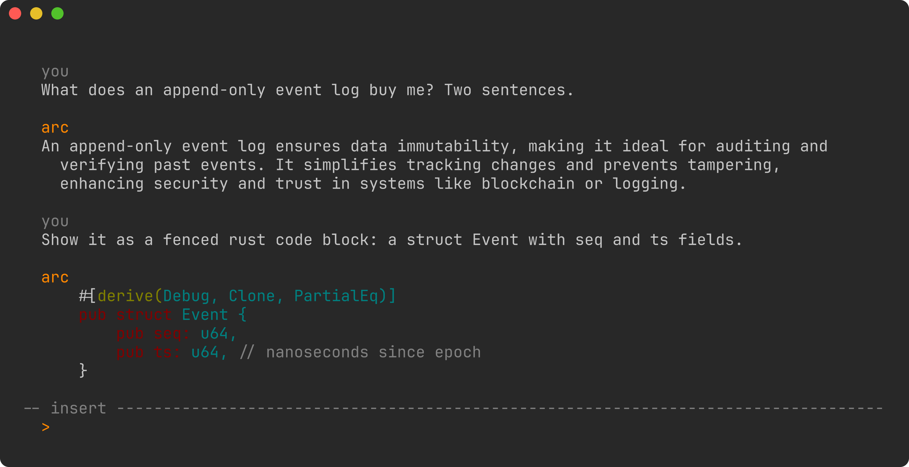

# ARC (Autonomous Robotic Core)

A personal AI assistant built as an always-on Rust daemon (`arcd`) with thin clients — a TUI today, voice later — talking to it over a local socket. Durable event-sourced memory, a stable identity, branching sessions, and swappable providers, starting with a local llama.cpp model.



It is one person's daily driver, built in the open. No stability promises, no releases, no multi-user story. [docs/DESIGN.md](docs/DESIGN.md) is the architectural authority and the honest account of what exists; [docs/TASKS.md](docs/TASKS.md) is what's being built now.

Four priorities, in order: **durability** (one append-only log, everything else rebuildable), **observability** (every LLM call, tool call, and memory write shows up in a Perfetto trace), **speed** (no GC, protobuf on disk and on the wire), **independence** (plain HTTP + SSE behind one provider trait, never vendor SDKs).

**Status:** Phase 1 (walking skeleton) is done and in daily use — local model, linear sessions, streaming TUI. Phase 2 (memory + tool calling) is in progress. Phases are in [DESIGN.md §11](docs/DESIGN.md).

## Running it

Needs a Rust toolchain, `protoc`, and llama.cpp's `llama-server` on your `PATH`. The Nix flake (`nix develop`) provides everything but the sidecar.

```sh
just model          # download the default GGUF (Qwen3-8B Q4_K_M, ~5GB) to data/models/
just build
cargo run -p arcd   # daemon: owns the log, supervises the sidecar, binds 127.0.0.1:8787
cargo run -p arc    # TUI, in another terminal
```

Config is `data/arc.toml`, every field optional — see the module docs in `arcd/src/config.rs`. Runtime state lives under `data/`: the log, the SQLite projection, `identity.md`, traces. `just install-service` sets up a systemd user unit.

## Layout

| Crate | What it is |
|---|---|
| `arc-proto` | protobuf schemas + prost types. The only place serialized formats are defined |
| `arc-core` | all logic: event log, projections, providers, tracing. Testable without a daemon |
| `arcd` | the daemon. Owns the log, serves the WebSocket |
| `arc` | the TUI client |
| `arc-voice` | voice client, Phase 4 placeholder |

`just build` / `test` / `fmt` / `lint`.

## Traces

Every `arcd` run writes one Perfetto trace to `data/traces/arc-<unix-seconds>.pftrace`, and says so in its first log line. Open it by dragging the file into <https://ui.perfetto.dev> — nothing is uploaded, the UI parses it in the browser. What you get: a row per session, the span tree of each turn under it (`session.send_message` → `openai.complete`), and counter tracks graphing tokens in and out.

To ask questions instead of looking, `trace_processor_shell` is in the dev shell:

```sh
nix develop --command trace_processor_shell data/traces/arc-*.pftrace
> select name, dur/1e6 as ms from slice order by dur desc limit 10;
> select name, value from stats where severity = 'error' and value > 0;   -- should be empty
```

The file is flushed packet by packet, so a trace can be opened while the daemon it belongs to is still running. `RUST_LOG` filters the trace and the stderr log together. Traces are disposable and excluded from backups; delete them whenever.

## License

MIT.
