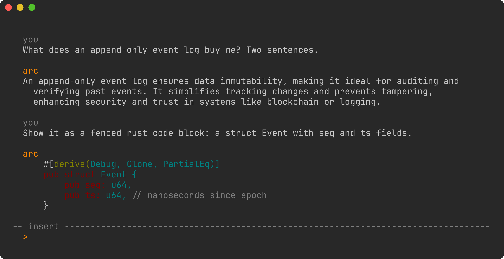

# ARC (Autonomous Robotic Core)

A personal assistant built around an always-on Rust daemon, terminal and web clients, branching conversations, durable memory, and replaceable providers. Development happens directly in a project-bound session; independent work runs as jobs.



One person's daily driver, built in the open. **Current phase: [4, voice + remote](docs/DESIGN.md#11-phases).** Web/mobile is deployed; voice and backup/restore remain unfinished. No releases, stability promises, or multi-user plan.

- [Design](docs/DESIGN.md) — architectural authority and crate layout.
- [Web client](arc-web/docs/DEVELOPMENT.md) — implemented interactions, deployment, and acceptance checks.
- [Providers](docs/providers.md) — configuration and dated measurements.
- [Testing](docs/testing.md) — focused runs, logs, rendered frames.

## Clients

The TUI and `arc-web` use the same binary protobuf protocol. The Svelte/TypeScript web client runs in desktop browsers and as a phone PWA. It supports conversations, streaming replies and tools, cancellation and steering across clients, jobs, project/model/thinking controls, and saved drafts. `arcd` owns sessions, models, tools, jobs, and memory.

See [web development](arc-web/docs/DEVELOPMENT.md) for setup, tailnet HTTPS deployment, and remaining acceptance checks. Installed-iPhone keyboard/lifecycle and long-session performance still need real-device testing. Voice is not a prerequisite.

## Build and run

The Nix development shell supplies Rust, `protoc`, Node 24, Buf, librsvg, and build tools. Local inference additionally needs `llama-server` and a GGUF; hosted-only configuration starts no sidecar.

```sh
nix develop
just build
# Configure data/arc.toml before starting:
target/debug/arcd run --config data/arc.toml
target/debug/arc  # another terminal
```

Without `--config`, arcd prefers `~/.config/arc/arc.toml`, then `data/arc.toml`. Missing configuration uses local defaults. For local inference, set `llama.model_file` to your GGUF; `just model` downloads the default under `~/.local/state/arc/models/`, not the checkout.

Runtime state follows `data_dir`: checkout default `data/`, installed convention `~/.local/state/arc/`. `just install` builds release binaries, installs the user service, and restarts it; run it after active turns/jobs finish. `just install-service` only installs the unit.

Checks: `just test`, `just fmt`, `just lint`.

For the web client, in the same shell:

```sh
cd arc-web
npm ci
npm run dev
```

From the repository root, `just web-build`, `just web-test`, `just web-test-browser`, `just web-proto`, and `just web-deploy` run frontend commands. Web deployment publishes static files only; it does not restart arcd.

## Traces

The daemon reports its Perfetto trace path at startup, under the data directory's `traces/`. Open it in Perfetto or query it from the development shell:

```sh
trace_processor_shell path/to/arc.pftrace
> select name, dur/1e6 as ms from slice order by dur desc limit 10;
```

Spans cover model calls, tools, memory, and jobs. `RUST_LOG` filters trace and stderr output. Traces are disposable and excluded from backups.

## License

MIT.
